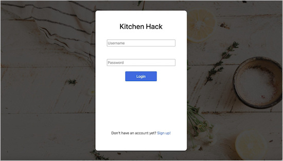
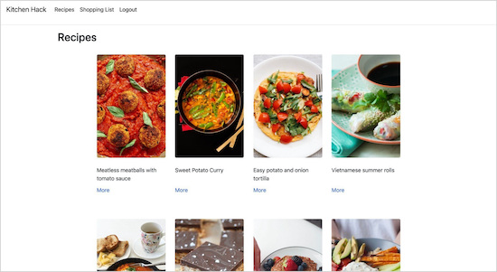
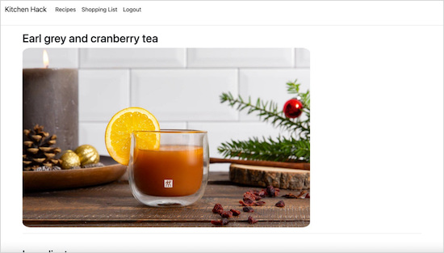
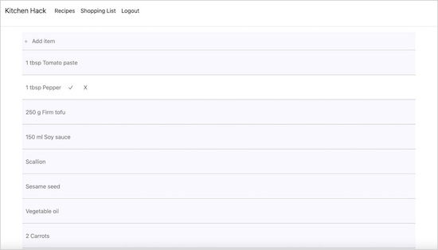

# Kitchen Hack
***Express - MongoDB - JavaScript - ES6 - Node.js - CSS - HTML***
 
 

>Kitchen Hack is a project that I started during an intensive 9-week coding bootcamp. After bootcamp, I remodeled the front-end and did some back-end work with the database. 

 
 

 
 

 
 

